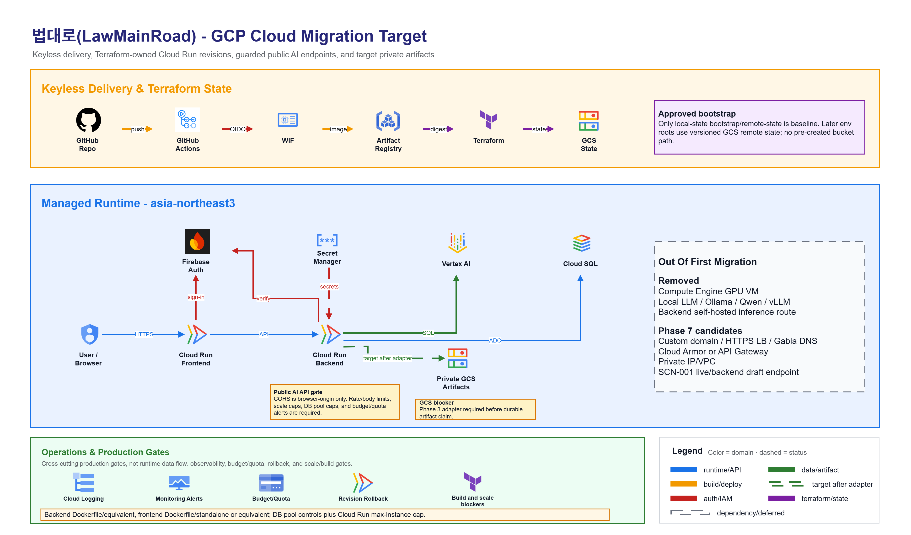
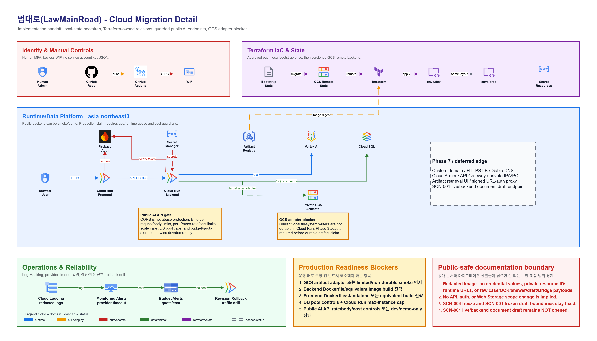
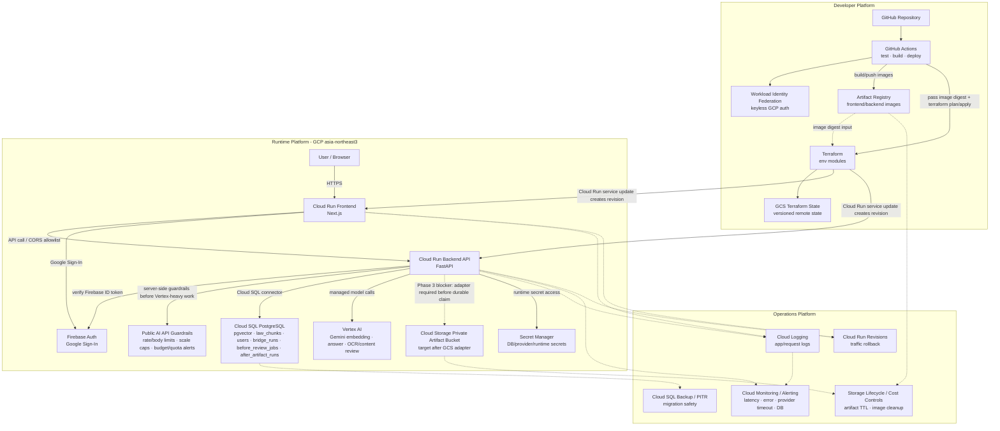

# 법대로(LawMainRoad) — Production-Oriented GCP Migration Architecture

기준일: `2026-05-06`

> 주의: 이 문서는 현재 로컬 MVP 구조가 아니라 후속 GCP cloud migration 목표
> 아키텍처다. 현재 구현 상태는
> [`current_project_architecture.md`](current_project_architecture.md)를 우선한다.

## 0. Visual Sources And Decision Authority

Cloud migration decisions are authoritative in this markdown file and
[`cloud_migration_phase_plan.md`](cloud_migration_phase_plan.md). The draw.io
files are visual sources for presentation and handoff; PNGs are generated
previews and must be re-exported whenever the draw.io source changes.

| Visual | Source | Use |
|---|---|---|
|  | [`images_drawio/final_architecture_overview.drawio`](images_drawio/final_architecture_overview.drawio) | 16:9 executive overview for README/issues/presentation |
|  | [`images_drawio/final_architecture_detail.drawio`](images_drawio/final_architecture_detail.drawio) | Implementation handoff for Terraform/Cloud Run/operations planning |

If a visual conflicts with this markdown spec or the phase plan, the markdown
spec and phase plan win. Regenerate the draw.io/PNG pair before presentation use.
The root [`cloud_migration_architecture.drawio`](cloud_migration_architecture.drawio)
is a secondary overview schematic kept for backward compatibility; current
presentation/handoff edits should start from the `images_drawio/` sources.

## 1. Migration Goal

기존 cloud migration 초안의 Compute Engine GPU VM / Local LLM / self-hosted inference
구성은 이번 목표 아키텍처에서 제외한다. 1차 cloud migration은 다음 방향으로
고정한다.

- Frontend / Backend는 Cloud Run에 배포한다.
- RAG embedding, answer generation, Before OCR/LLM 경로는 managed Vertex AI
  경로를 유지한다.
- PostgreSQL + pgvector는 Cloud SQL로 이전한다.
- Before/After runtime artifacts are moved from local directories to a private
  Cloud Storage artifact bucket, or the deployment is explicitly marked
  limited/non-durable smoke until the GCS adapter is implemented.
- GitHub Actions, Artifact Registry, Terraform remote state, Secret Manager,
  Cloud Logging/Monitoring/Alerting, rollback/runbook까지 포함해 운영 가능한
  구조로 문서화한다.

### Terraform Authoring Boundary

Terraform is the infrastructure authoring tool for this migration, not an
application behavior migration tool.

| Boundary | Contract |
|---|---|
| Phase sizing | Author Terraform in small phase roots. Phase 0 is docs/decision freeze only; Phase 1 is the first resource phase. |
| Application contract | Terraform must not change `/api/v1/answer`, `/api/v1/documents/draft`, protected SCN-001 Bridge/history behavior, SCN-004 freeze, SCN-001 frozen draft, auth persistence, or Web Storage policy. |
| Optional edge | Custom domain / Firebase Hosting edge / Gabia DNS is Phase 7A optional hardening, not a Phase 1-6 prerequisite. HTTPS Load Balancer remains a later edge candidate. |
| State | Shared applies use a GCS remote state bucket after bootstrap. The approved baseline is local-state `bootstrap/remote-state` for the first state bucket creation, followed by GCS backend initialization for later env roots. A separate pre-created bootstrap bucket is not the approved baseline. |
| Cloud Run revision ownership | Build/push images outside Terraform, pass an immutable image digest or explicit tag into Terraform, and let Terraform update Cloud Run service config/traffic so the apply creates the revision. `gcloud run deploy` is not the steady-state path while Terraform owns Cloud Run; emergency manual changes must be reconciled back into Terraform. |
| Secrets | Terraform may create Secret Manager resources and IAM bindings, but raw secret values and credential-bearing outputs stay out of `.tf` files, tfvars, Terraform state, GitHub Actions logs, and public evidence. |
| Internal inventory | Project id/number, service account email, bucket name, Cloud SQL connection name, WIF provider name, Secret Manager resource name, state bucket name, and direct backend `run.app` URL are internal cloud inventory. |
| Destructive actions | Destroy/replacement of prod state bucket, Cloud SQL, artifact bucket, service accounts, or runtime services requires explicit human approval and rollback notes. |

The IaC path is documented in
[`cloud_migration_phase_plan.md`](cloud_migration_phase_plan.md#3-recommended-terraform-layout)
as `infra/terraform/envs/{dev,prod}` plus focused modules such as
`cloud-run-service`, `cloud-sql-pgvector`, `artifact-bucket`, `iam-wif`,
`secret-manager`, and optional `load-balancer-domain`. Phase 1 now contains the
bootstrap/foundation Terraform roots and Phase 1 modules under `infra/terraform`;
later phase roots/modules remain unopened until their phase is approved.

### Human MFA And Runbook Script Boundary

| Area | Target Handling |
|---|---|
| Human GCP MFA | All human accounts used for GCP Console, `gcloud`, Terraform bootstrap, production approval, DNS cutover, or emergency rollback must enable Google 2-Step Verification/MFA before Phase 1 resource apply. Record only PASS/FAIL evidence. |
| Organization enforcement | If the project uses Google Workspace or Cloud Identity, enforce/check admin MFA through the Admin console. If a personal Google account is used, enable account-level 2-Step Verification and keep recovery codes out of repo/docs. |
| CI/CD auth | GitHub Actions uses Workload Identity Federation and short-lived credentials, not a human MFA prompt and not service account key JSON. |
| Shell/Python runbook scripts | Small scripts are allowed for describe checks, smoke checks, migration/seed orchestration, log redaction checks, and rollback drills. They should run after Terraform-created resources exist and after required human approvals. |
| Runbook script boundary | Scripts must not become a second source of truth for Terraform-owned resources, must not store secret values, and must not bypass manual approvals for DB mutation, DNS cutover, production deploy, or rollback. Prefer shell for CLI wrappers and Python for structured JSON/API/log assertions. |
| Compute/OS Login note | The first target has no Compute Engine VM. If a future Phase 7 candidate adds VMs, OS Login with 2FA becomes a hardening requirement, not a current Phase 1-6 task. |

The GCP MFA helper can mirror the local usability of `aws-mfa-main-guide1`, but
not its credential model. AWS MFA scripts commonly call STS with an OTP and
export temporary access keys. GCP should instead use a future
`gcp-mfa-main-guide1/` helper that confirms browser-based Google login, ADC,
active project, optional `terraform-sa` impersonation, and `PASS/FAIL` MFA
attestation. It must not collect OTP/recovery material or create service account
key JSON.

### Explicitly Removed

| 제거 대상 | 이유 |
|---|---|
| Compute Engine GPU VM | 1차 migration 목표에서 Local LLM 운영을 하지 않음 |
| Ollama / Qwen self-hosted inference | 현재 MVP 기본 경로와 다르고 운영 복잡도/비용이 큼 |
| Backend API -> Local LLM route | managed Vertex AI route로 단순화 |
| Local LLM warm state / inference health | 제거된 구성의 운영 항목 |

## 2. Target Runtime Architecture



## 3. CI/CD Architecture

### Pipeline Shape

```text
Pull Request
  -> frontend build/type check
  -> backend import/test/smoke
  -> document draft deterministic smoke
  -> terraform fmt/validate/plan
  -> secret/dependency scan

main branch
  -> GitHub Actions OIDC token
  -> Workload Identity Federation
  -> build frontend/backend container images
  -> push Artifact Registry
  -> pass immutable image digests/tags to Terraform
  -> terraform plan/apply for Cloud Run service/env/traffic config
  -> Cloud Run creates new revisions from Terraform-owned service updates
  -> run DB migration / seed job when required
  -> post-deploy smoke test
  -> keep previous stable revision for rollback
```

Terraform owns Cloud Run service configuration, runtime env/secret references,
IAM attachment, image reference, scaling, and steady-state traffic. CI/scripts
own image build/push, migration/seed orchestration, smoke checks, log-redaction
checks, and rollback command execution. CI may invoke Terraform, but it should
not use `gcloud run deploy` as the normal revision owner because that creates
Terraform drift.

### Minimum Quality Gates

| Area | Gate |
|---|---|
| Frontend | `npm run build` |
| Backend | `python -c "from backend.main import app; print('import_ok')"` |
| Document draft | local deterministic smoke: `python backend/verify/check_document_draft.py` |
| API smoke | post-deploy `/health`, `/api/v1/retrieve`, one demo `/api/v1/answer` query |
| Infra | `terraform fmt`, `terraform validate`, `terraform plan` |
| Security | secret scan, dependency scan, no service account key JSON in repo, no cloud inventory in public evidence |
| Deploy | Cloud Run health check and one post-deploy scenario smoke |
| Container readiness | backend Cloud Run image build strategy exists before Phase 3; frontend Cloud Run image build strategy exists before Phase 4, including `NEXT_PUBLIC_*` build-time handling |
| Public AI endpoint guardrail | public Vertex-calling paths have server-side request/cost controls or the deployment is explicitly marked dev/demo-only |

### Build Readiness Status

Phase 3/4 cannot claim Cloud Run readiness with only source-tree import/build
checks. A docs-only code read rechecked on `2026-05-06` found no
`backend/Dockerfile`, no `frontend/Dockerfile`, and no `output: "standalone"`
setting in `frontend/next.config.mjs`.

Before Cloud Run deployment readiness is claimed:

- Phase 3 must add `backend/Dockerfile` or approve an equivalent backend image
  build strategy.
- Phase 4 must add `frontend/Dockerfile` plus Next.js standalone output, or
  approve an equivalent frontend image build strategy.
- Frontend images must receive `NEXT_PUBLIC_API_BASE_URL` and Firebase
  `NEXT_PUBLIC_*` values at build time because those values are bundled into the
  browser build.

## 4. Security & IAM

### Service Accounts

| Service account | Used by | Minimum responsibility |
|---|---|---|
| `frontend-sa` | Cloud Run Frontend | Call backend if backend ingress later requires IAM auth |
| `backend-sa` | Cloud Run Backend | Cloud SQL Client, Secret Accessor for needed secrets, bucket-scoped Storage Object access, Vertex AI User, Firebase Auth verification IAM if ADC path requires it |
| `github-actions-sa` | GitHub Actions deploy workflow | Push Artifact Registry images, run smoke checks, and invoke/impersonate the Terraform execution path through Workload Identity Federation |
| `terraform-sa` | Terraform workflow | Create/update approved infra resources, including Cloud Run service config/image reference/traffic, with explicit roles from the phase plan; avoid broad Owner-style use |

GitHub Actions should authenticate through Workload Identity Federation, not a long-lived
service account key. The deployer also needs `iam.serviceAccountUser` on the runtime service
accounts when attaching them to Cloud Run services.

The detailed `terraform-sa` role list is owned by
[`cloud_migration_phase_plan.md`](cloud_migration_phase_plan.md#phase-1--bootstrap--foundation)
to avoid role drift between documents. Do not grant `roles/owner` or `roles/editor`
for normal Terraform execution. If IAM binding creation requires a broader
bootstrap-only permission, document it as a temporary administrator action and
remove it after foundation apply.

Firebase Admin SDK service-agent roles such as `roles/firebase.sdkAdminServiceAgent`
should not be granted to normal runtime service accounts. If backend ADC requires Firebase
Authentication permissions beyond ID token verification defaults, use a grantable Firebase
Auth role such as `roles/firebaseauth.admin` or a narrower custom role after validation.

### Secret Boundary

| Secret / config | Target handling |
|---|---|
| DB credentials / connection settings | Secret Manager + Cloud Run secret injection |
| Provider/runtime keys if any | Avoid for Google Cloud APIs; if an external provider key is ever introduced, keep it in Secret Manager and version-pin where practical |
| Firebase public web config | Next.js build-time `NEXT_PUBLIC_*` build args / public env; these are public client config, not private secrets |
| Firebase Admin credential | Use Cloud Run service identity / ADC for the current migration. Do not create a Firebase Admin JSON secret or service account key JSON in Phase 1-6; if ADC cannot be made to work, open a separate security exception instead of silently adding a key fallback. |
| App signing/session secret if introduced later | Secret Manager |

The current MVP frontend uses Firebase `inMemoryPersistence`; cloud migration does not change
that policy by default.

### Runtime / Environment Boundary

| Config Class | Target Handling |
|---|---|
| `NEXT_PUBLIC_API_BASE_URL` | Frontend build-time public env. It is bundled into the browser build, so backend host changes require a frontend rebuild/redeploy. |
| Firebase Web config | Public client config passed as frontend build-time `NEXT_PUBLIC_*` values. Public does not mean unmanaged: Firebase Authorized Domains must include the deployed frontend host. |
| Backend secrets/env | Secret Manager for credential-bearing values; plain runtime env only for non-secret config. Do not expose secret values as Terraform outputs. |
| Cloud Run service identity | Backend runtime uses attached `backend-sa` and ADC for Google APIs. Local `GOOGLE_APPLICATION_CREDENTIALS` remains a developer smoke/debug path only. |
| Vertex AI | Backend-only managed Vertex path through ADC/service identity. No Vertex API key, service account key JSON, or `GOOGLE_APPLICATION_CREDENTIALS_JSON` in Cloud Run. |
| Firebase Admin | Backend-only Firebase Admin SDK path through ADC/service identity. Do not set `GOOGLE_APPLICATION_CREDENTIALS` or a Firebase Admin JSON secret on Cloud Run for the current migration. |
| Artifact bucket env | `ARTIFACT_BUCKET_NAME` is only the preferred candidate backend env var for the future GCS adapter. Do not write docs or Terraform as if it is an active runtime contract until Phase 3 implements or verifies adapter support. Keep it separate from the `lmr-{env}-artifacts` bucket naming pattern. |

### Vertex AI Credential Boundary

Vertex AI must be called from backend runtime only, using the Cloud Run
`backend-sa` service identity and Application Default Credentials. The migration
target must not create, store, or expose a Vertex AI API key or service account
key JSON for application runtime.

Required rules:

- Do not put Vertex/GCP credentials in frontend `NEXT_PUBLIC_*` variables.
- Do not bake `GOOGLE_APPLICATION_CREDENTIALS`, service account JSON, `.env`, or
  ADC files into backend/frontend images.
- Do not set `GOOGLE_APPLICATION_CREDENTIALS` on Cloud Run when using service
  identity. Let Cloud Run ADC resolve the attached runtime service account.
- Grant `backend-sa` only the minimum Vertex IAM needed for the current managed
  model calls, for example `roles/aiplatform.user` or a narrower reviewed custom
  role when practical.
- Do not grant Vertex service-agent roles to normal runtime/deploy service
  accounts.
- CI/CD must use Workload Identity Federation, not service account key JSON.
- If a temporary local admin path is used before WIF, it uses local user auth or
  service-account impersonation; no key file is committed, uploaded, or copied
  into GitHub Secrets.

### Cloud Identifier Exposure Boundary

Some cloud values are not cryptographic secrets but still should not be exposed
in public portfolio pages, screenshots, issue text, logs, or frontend UI because
they reveal the project inventory.

| Class | Examples | Public portfolio policy |
|---|---|---|
| Never public | service account key JSON, Firebase Admin JSON, DB URL/password, OAuth client secrets, access tokens, refresh tokens, raw artifact payloads | never show, commit, log, or store in browser |
| Internal-only cloud identifiers | GCP project id/number, service account emails, Cloud SQL connection name, Secret Manager resource names, artifact bucket name, Terraform state bucket, WIF provider full resource name, Artifact Registry repo URL, backend direct `run.app` URL if custom domain is live | use placeholders in public docs/screenshots; keep exact values in private runbooks or Terraform state only |
| Public launch values | approved custom frontend domain, approved custom API domain if opened | can be shown after Phase 7A approval and smoke |
| Public client config | Firebase web config, custom frontend origin | not a private secret, but avoid pasting full config in public docs unless needed |

Public portfolio material should prefer:

```text
app.<domain>
api.<domain>
<gcp-project-id>
<backend-sa>@<project>.iam.gserviceaccount.com
gs://<artifact-bucket>
```

rather than real project, service account, bucket, Cloud SQL, WIF, or direct
Cloud Run identifiers.

## 5. Network & Access Control

### Phase 1 Practical Baseline

| Component | Access model |
|---|---|
| Cloud Run Frontend | public HTTPS |
| Cloud Run Backend | public HTTPS with strict CORS allowlist; protected SCN-001 endpoints still require Firebase Bearer token. CORS is browser-origin control only and is not abuse/cost protection. |
| Cloud SQL | Cloud SQL connector from backend service account |
| Cloud Storage artifacts | private bucket, public access prevention, uniform bucket-level access |
| Secret Manager | runtime service accounts only |

### Mandatory Public AI Endpoint Guardrails

The first backend target can use public Cloud Run HTTPS for smoke/demo traffic,
but public Vertex-calling endpoints must not be described as production-ready
until server-side abuse and cost controls are explicit. CORS does not protect
the API from non-browser clients.

Required before any production-oriented public backend claim:

| Control | Required baseline |
|---|---|
| Request and body limits | Set server/API limits for `/api/v1/answer`, `/api/v1/retrieve`, and Before upload/OCR paths. Reject oversized payloads before Vertex or DB-heavy work. |
| Server-side rate/cost limit | Add per-IP and, where authenticated, per-user request limits for Vertex-calling routes, or explicitly mark the deployment dev/demo-only until an approved limiter/edge policy is opened. |
| Cloud Run scale cap | Set conservative max instances, concurrency, timeout, and DB pool caps together so abuse cannot silently multiply Vertex and Cloud SQL cost. |
| Budget/quota alerts | Add budget alerts and Vertex/request-count monitoring in Phase 6, with manual billing checklist fallback if Terraform lacks billing permissions. |
| Abuse logging | Log route, status, latency, coarse caller bucket, provider error type, and request size class without raw case payloads, Firebase uid, provider subject, tokens, or raw Bridge payload. |
| Edge escalation trigger | If public traffic expands beyond controlled demo use, open Phase 7 design for Cloud Armor/API Gateway/HTTPS LB or equivalent edge protection. |

Until these controls pass, the public backend is a dev/demo smoke target, not a
production abuse-resistant public AI API.

### Later Hardening Candidates

| Candidate | When to add |
|---|---|
| Backend Cloud Run IAM auth / service-to-service auth | When frontend/backend split needs non-public backend ingress |
| Firebase Hosting custom domain edge | selected Phase 7A portfolio launch candidate, after Cloud Run `run.app` smoke is stable |
| HTTPS Load Balancer + serverless NEG | future Phase 7 edge candidate when Cloud Armor or centralized routing is justified |
| Cloud Armor | Phase 7 edge hardening for public abuse protection/rate limiting beyond the mandatory app/runtime guardrails |
| Private IP + Serverless VPC Access or Direct VPC egress | When network isolation becomes worth the added Terraform complexity |
| API Gateway | When external API productization or API-key style policy is needed |

### Phase 7A Portfolio Domain Launch

The first Cloud Run migration can be considered valid on the default `run.app`
URLs. A purchased domain, for example through Gabia, is a portfolio/public launch
hardening step rather than a Phase 1-6 requirement.

For the purchased `law-main-road.cloud` domain, Phase 7A selects Firebase Hosting
custom domain routing as the lightweight public demo edge. This keeps the first
custom-domain pass smaller than a Google external Application Load Balancer while
still using managed HTTPS and Cloud Run rewrites:

```text
Gabia DNS
  -> Firebase Hosting custom domain / managed certificate
  -> Hosting rewrite `/**` to Cloud Run frontend
  -> optional Hosting rewrite `/api/**` to Cloud Run backend
```

Recommended public host split:

| Host | Target | Notes |
|---|---|---|
| `www.law-main-road.cloud` | Cloud Run frontend through Firebase Hosting | portfolio/demo entrypoint |
| `law-main-road.cloud` | redirect to `www` or same Hosting target | decide during Phase 7A implementation |
| `api.law-main-road.cloud` | defer | open only if a separate custom API domain is approved |

Required boundary decisions:

- Add the chosen frontend host to Firebase Authentication Authorized Domains.
- Rebuild frontend with the approved backend base URL if moving from backend
  `run.app` to same-origin `https://www.law-main-road.cloud/api/**`.
- Re-apply backend `BACKEND_CORS_ORIGIN_REGEX` to the approved frontend origin
  when any browser cross-origin path remains or for rollback compatibility.
- Keep Cloud Run direct `run.app` URLs documented for rollback unless disabled
  after a separate ingress/rollback design.
- Do not change public API contracts, SCN-004 freeze behavior, SCN-001 frozen
  draft behavior, auth persistence, or Web Storage policy as part of the domain
  launch.

## 6. Data & Artifact Management

### Cloud SQL

```text
Cloud SQL PostgreSQL
  -> pgvector extension
  -> law_chunks
  -> users
  -> before_review_jobs
  -> bridge_runs
  -> after_artifact_runs
```

Operational rules:

- Schema changes are managed by Alembic or explicit SQL migrations.
- `pgvector` extension and HNSW/vector indexes are created through migration/init scripts.
- `law_chunks` seed import is a deploy-time or one-off seed step, not ad hoc console work.
- Dev starts with minimum viable Cloud SQL PostgreSQL + pgvector. Exact dev
  tier/storage is decided before Phase 2 apply.
- Dev backup retention target is 1-3 days.
- Prod later starts with a small production tier.
- Prod backup retention baseline is 7 days.
- PITR is a prod-only baseline, with a cost exception allowed before prod opens.
- HA is deferred initially.
- Migration before destructive schema changes requires backup and rollback notes.

### Runtime Artifacts

Before contract upload artifacts are sensitive because they can include worker personal data,
workplace details, wage data, addresses, or contract text. After answer/draft artifacts can
also include raw user statements, answer request/response JSON, draft request/response JSON,
and legal-basis snapshots. Cloud migration should move local runtime artifact storage to a
private bucket, or explicitly label the Cloud Run deployment as limited/non-durable smoke.

The GCS artifact adapter is a Phase 3 production-readiness blocker or a dedicated
implementation issue before any durable Cloud Run claim. Terraform can provision
the private bucket and IAM, but it must not pretend the current local filesystem
writers are already using GCS. Diagrams must show the backend-to-GCS artifact
edge as a target-after-adapter path or attach an explicit blocker callout, never
as an already-implemented durable runtime path. Signed URLs, authenticated proxy
retrieval, and artifact retrieval UI/API remain decision-needed and unsupported
until a separate authorization design is approved.

Current local paths that must not be treated as durable Cloud Run storage:

| Current path | Target prefix | Notes |
|---|---|---|
| `backend/data/before_artifacts/runs/<run_id>/` | `before-runs/{run_id}/` | uploaded files, OCR output, review result, user explanation, error text |
| `backend/data/after_artifacts/runs/<run_id>/` | `after-runs/{run_id}/` | answer/draft request and response artifacts, query hash metadata in DB |

Candidate bucket layout:

```text
gs://lmr-{env}-{project_id}-artifacts/before-runs/{run_id}/
  original-upload
  ocr_output.json
  review_result.json
  user_explanation.md
  error.txt

gs://lmr-{env}-{project_id}-artifacts/after-runs/{run_id}/
  user_statement.txt
  answer_request.json
  answer_response.json
  draft_request.json
  draft_response.json
```

Storage policy:

- No public bucket/object access.
- Backend-mediated access only; signed URLs or an auth proxy are decision-needed
  before any artifact retrieval UI/API is opened.
- `lmr-{env}-artifacts` is a bucket naming pattern, not an environment variable
  name. `ARTIFACT_BUCKET_NAME` is only a preferred candidate backend env var for
  the future GCS adapter and must not be wired as active runtime config until
  Phase 3 implements or verifies adapter support.
- Lifecycle deletion after a short retention window, for example 7 or 30 days.
- Logs must not include raw contract text, Firebase uid, provider subject, email, tokens, or
  raw Bridge payload.

Static/media boundary:

- No separate public static/media bucket is required for the first target.
- Next.js static assets are served from the frontend Cloud Run image.
- Cloud Storage in this migration target is private runtime artifact storage, not public
  website hosting.

## 7. Observability

### Structured Logs

Recommended fields:

| Field | Purpose |
|---|---|
| `request_id` | request-level correlation |
| `route` / `method` / `status` / `latency_ms` | API health |
| `run_id` | Before review trace |
| `bridge_run_id_hash` | Bridge handoff trace without logging user-visible raw ids |
| `answer_origin` | regular vs bridge handoff |
| `provider` / `provider_error_type` | Vertex/OCR timeout or provider failure analysis |
| `user_id_hash` | optional internal correlation without raw provider identifier |

### Metrics / Alerts

| Metric | Alert candidate |
|---|---|
| 5xx error rate | sustained backend failure |
| `/api/v1/answer` latency | answer path degradation |
| Before OCR success/failure | OCR pipeline health |
| `provider_timeout` count | repeated Vertex/provider instability |
| Cloud SQL CPU/connections | DB saturation |
| Cloud Run instance count/cold start symptoms | scaling/cost signal |

## 8. Reliability & Rollback

### Application Rollback

Cloud Run deployments create revisions. The deployment runbook should keep the previous stable
revision available and move traffic back if smoke tests fail.

```text
new revision deployed
  -> health check
  -> scenario smoke
  -> fail: shift traffic back to previous stable revision
  -> pass: keep new revision as stable
```

### DB Rollback

- Prefer backward-compatible migrations.
- Avoid destructive migrations in MVP/demo production.
- Take a backup before schema changes that affect protected history/artifact linkage.
- Keep `law_chunks` seed version tied to `selected_as_of = 2026-04-11` unless a deliberate
  corpus update is opened.

### Provider Failure Handling

Existing residual risk is transient `provider_timeout`. Cloud migration should preserve
user-friendly errors and add:

- retry with bounded backoff where safe,
- structured provider error logs,
- alert when timeout count crosses threshold,
- no raw user/case payload in error logs.

## 9. Cost Management

| Service | Control |
|---|---|
| Cloud Run | low min instances for dev; prod min instance only if latency requires it |
| Cloud SQL | dev minimum viable first; prod small tier later; dev backup 1-3 days and prod backup 7-day baseline |
| Billing/Budget | budget alert as a Terraform-managed target where billing permissions allow; otherwise billing/admin manual checklist fallback |
| Vertex AI | demo preset fixed path avoids unnecessary `/answer` calls; public Vertex-calling routes require server-side rate/cost controls, request/body limits, Cloud Run scale caps, and budget/quota alerts before production claim |
| Cloud Storage | artifact lifecycle deletion |
| Artifact Registry | image cleanup policy |
| Cloud Logging | retention/exclusion policy for noisy non-audit logs |

Cloud SQL cost control must be paired with connection control. The Phase 2/3
migration target should expose explicit `DB_POOL_SIZE`, `DB_MAX_OVERFLOW`, and
`DB_POOL_TIMEOUT_SECONDS`-style controls, or an equivalent reviewed SQLAlchemy
pool configuration, so Cloud Run scale-out does not silently exceed small Cloud
SQL tier limits. A docs-only code read on `2026-05-04` confirmed the current
`backend/app/db.py` initializes from `DATABASE_URL` only, so do not claim this
guardrail is production-ready until Phase 3 implements or verifies the runtime
pool controls. Before production Cloud Run rollout, set the chosen controls and
verify:

```text
(pool_size + max_overflow) * backend_max_cloud_run_instances
  < Cloud SQL max_connections - reserved admin connections
```

For early small-tier testing, start with a conservative target such as `pool_size=2`,
`max_overflow=3`, and a low Cloud Run `max_instance_count`, then tune from observed load.

Vertex cost control must be paired with public API control. If the app-level
limiter or equivalent approved edge control is not implemented yet, keep public
Vertex-calling routes in dev/demo smoke mode and avoid calling the deployment
production-ready.

## 10. Terraform Module Structure

Detailed Terraform root layout and module ownership are defined in
[`cloud_migration_phase_plan.md`](cloud_migration_phase_plan.md#3-recommended-terraform-layout).
That phase plan is the single source of truth for Terraform entry points and
phase numbering.

The first cloud migration target is `dev` only. The Phase 1 Terraform layout now
contains apply-ready dev bootstrap/foundation roots and a prod foundation
skeleton only. The initial GCP model uses one project with env-prefixed
resources; separate dev/prod projects are deferred to future hardening.

## 11. Migration Roadmap

Detailed phase gates, Terraform roots, and verification gates are tracked in
[`cloud_migration_phase_plan.md`](cloud_migration_phase_plan.md). The table below
mirrors that plan at a high level; update the phase plan first if sequencing
changes.

| Phase | Scope | Notes |
|---:|---|---|
| 0 | Docs / Design Freeze | no runtime behavior change |
| 1 | Bootstrap + Foundation | remote state, APIs, service accounts, Artifact Registry, Secret Manager shells, artifact bucket |
| 2 | Data Foundation | Cloud SQL PostgreSQL + migration-ready DB; pgvector/schema/index/seed by scripts |
| 3 | Backend Runtime | Cloud Run backend revision, env/secret wiring, Cloud SQL connector, Vertex/Storage access |
| 4 | Frontend Runtime | Cloud Run frontend revision, public env wiring, Firebase domain check |
| 5 | CI/CD | GitHub Actions + Workload Identity Federation keyless deploy pipeline |
| 6 | Observability / Reliability | logging metrics, alert policies, rollback drill, cleanup policies |
| 7 | Optional Hardening | Firebase Hosting edge for Phase 7A; VPC/LB/Cloud Armor/API Gateway/jobs only after separate approval |

## 12. Not In Scope For This Target

- Compute Engine GPU VM
- Ollama/Qwen/vLLM self-hosted model serving
- independent `/bridge` route
- live/backend SCN-001 document draft generation
- protected SCN-001 draft endpoint
- Step 3 full retention lifecycle beyond MVP soft-delete
- API Gateway / Cloud Armor / VPC private IP as first migration requirements

## 13. References

- Google Cloud Well-Architected Framework:
  <https://cloud.google.com/architecture/framework>
- Cloud Run:
  <https://cloud.google.com/run>
- Cloud Run service identity:
  <https://cloud.google.com/run/docs/securing/service-identity>
- Cloud Run secrets:
  <https://cloud.google.com/run/docs/configuring/services/secrets>
- Vertex AI authentication:
  <https://cloud.google.com/vertex-ai/docs/authentication>
- Google Cloud service account key best practices:
  <https://cloud.google.com/iam/docs/best-practices-for-managing-service-account-keys>
- Cloud Run rollbacks and traffic migration:
  <https://cloud.google.com/run/docs/rollouts-rollbacks-traffic-migration>
- Workload Identity Federation:
  <https://cloud.google.com/iam/docs/workload-identity-federation>
- `google-github-actions/auth`:
  <https://github.com/google-github-actions/auth>
- Google Workspace / Cloud Identity admin 2-Step Verification enforcement:
  <https://knowledge.workspace.google.com/admin/security/about-2sv-enforcement-for-admins>
- Compute Engine OS Login with 2FA, if a future VM candidate is opened:
  <https://cloud.google.com/compute/docs/oslogin/set-up-oslogin>
- Cloud SQL for PostgreSQL best practices:
  <https://cloud.google.com/sql/docs/postgres/best-practices>
- Cloud Run to Cloud SQL:
  <https://cloud.google.com/sql/docs/postgres/connect-run>
- Cloud Storage public access prevention:
  <https://cloud.google.com/storage/docs/public-access-prevention>
- Cloud Storage uniform bucket-level access:
  <https://cloud.google.com/storage/docs/uniform-bucket-level-access>
- Cloud Monitoring alerting:
  <https://cloud.google.com/monitoring/alerts>
- Artifact Registry cleanup policies:
  <https://cloud.google.com/artifact-registry/docs/repositories/cleanup-policy>
