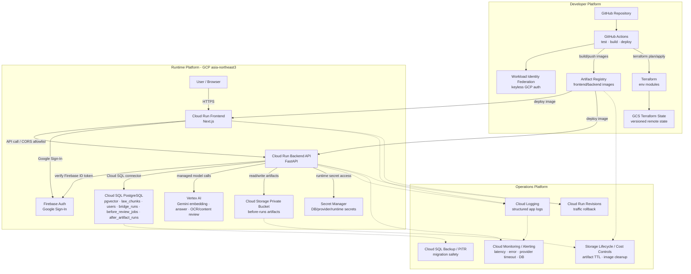

# K-Labor Shield — Production-Oriented GCP Migration Architecture

기준일: `2026-04-29`

> 주의: 이 문서는 현재 로컬 MVP 구조가 아니라 후속 GCP cloud migration 목표
> 아키텍처다. 현재 구현 상태는
> [`current_project_architecture.md`](current_project_architecture.md)를 우선한다.

## 1. Migration Goal

기존 cloud migration 초안의 Compute Engine GPU VM / Local LLM / self-hosted inference
구성은 이번 목표 아키텍처에서 제외한다. 1차 cloud migration은 다음 방향으로
고정한다.

- Frontend / Backend는 Cloud Run에 배포한다.
- RAG embedding, answer generation, Before OCR/LLM 경로는 managed Vertex AI
  경로를 유지한다.
- PostgreSQL + pgvector는 Cloud SQL로 이전한다.
- Before artifact는 local directory가 아니라 private Cloud Storage bucket으로
  이전한다.
- GitHub Actions, Artifact Registry, Terraform remote state, Secret Manager,
  Cloud Logging/Monitoring/Alerting, rollback/runbook까지 포함해 운영 가능한
  구조로 문서화한다.

### Explicitly Removed

| 제거 대상 | 이유 |
|---|---|
| Compute Engine GPU VM | 1차 migration 목표에서 Local LLM 운영을 하지 않음 |
| Ollama / Qwen self-hosted inference | 현재 MVP 기본 경로와 다르고 운영 복잡도/비용이 큼 |
| Backend API -> Local LLM route | managed Vertex AI route로 단순화 |
| Local LLM warm state / inference health | 제거된 구성의 운영 항목 |

## 2. Target Runtime Architecture



## 3. CI/CD Architecture

### Pipeline Shape

```text
Pull Request
  -> frontend build/type check
  -> backend import/test/smoke
  -> document draft deterministic smoke
  -> terraform fmt/validate/plan
  -> secret/dependency scan

main branch
  -> GitHub Actions OIDC token
  -> Workload Identity Federation
  -> build frontend/backend container images
  -> push Artifact Registry
  -> terraform plan/apply
  -> run DB migration / seed job when required
  -> deploy Cloud Run revisions
  -> post-deploy smoke test
  -> keep previous stable revision for rollback
```

### Minimum Quality Gates

| Area | Gate |
|---|---|
| Frontend | `npm run build` |
| Backend | `python -c "from backend.main import app; print('import_ok')"` |
| Document draft | local deterministic smoke: `python backend/verify/check_document_draft.py` |
| API smoke | post-deploy `/health`, `/api/v1/retrieve`, one demo `/api/v1/answer` query |
| Infra | `terraform fmt`, `terraform validate`, `terraform plan` |
| Security | secret scan, dependency scan, no service account key JSON in repo |
| Deploy | Cloud Run health check and one post-deploy scenario smoke |

## 4. Security & IAM

### Service Accounts

| Service account | Used by | Minimum responsibility |
|---|---|---|
| `frontend-sa` | Cloud Run Frontend | Call backend if backend ingress later requires IAM auth |
| `backend-sa` | Cloud Run Backend | Cloud SQL Client, Secret Accessor for needed secrets, bucket-scoped Storage Object access, Vertex AI User, Firebase Auth verification IAM if ADC path requires it |
| `github-actions-sa` | GitHub Actions deploy workflow | Push Artifact Registry images and deploy Cloud Run revisions through Workload Identity Federation |
| `terraform-sa` | Terraform workflow | Create/update approved infra resources with explicit roles from the phase plan; avoid broad Owner-style use |

GitHub Actions should authenticate through Workload Identity Federation, not a long-lived
service account key. The deployer also needs `iam.serviceAccountUser` on the runtime service
accounts when attaching them to Cloud Run services.

The detailed `terraform-sa` role list is owned by
[`cloud_migration_phase_plan.md`](cloud_migration_phase_plan.md#phase-1--bootstrap--foundation)
to avoid role drift between documents. Do not grant `roles/owner` or `roles/editor`
for normal Terraform execution. If IAM binding creation requires a broader
bootstrap-only permission, document it as a temporary administrator action and
remove it after foundation apply.

Firebase Admin SDK service-agent roles such as `roles/firebase.sdkAdminServiceAgent`
should not be granted to normal runtime service accounts. If backend ADC requires Firebase
Authentication permissions beyond ID token verification defaults, use a grantable Firebase
Auth role such as `roles/firebaseauth.admin` or a narrower custom role after validation.

### Secret Boundary

| Secret / config | Target handling |
|---|---|
| DB credentials / connection settings | Secret Manager + Cloud Run secret injection |
| Provider/runtime keys if any | Secret Manager, version pinned where practical |
| Firebase public web config | Next.js build-time `NEXT_PUBLIC_*` build args / public env; these are public client config, not private secrets |
| Firebase Admin credential | Prefer GCP ADC/service identity. Use Secret Manager only if a separate credential is unavoidable |
| App signing/session secret if introduced later | Secret Manager |

The current MVP frontend uses Firebase `inMemoryPersistence`; cloud migration does not change
that policy by default.

## 5. Network & Access Control

### Phase 1 Practical Baseline

| Component | Access model |
|---|---|
| Cloud Run Frontend | public HTTPS |
| Cloud Run Backend | public HTTPS with strict CORS allowlist; protected SCN-001 endpoints still require Firebase Bearer token |
| Cloud SQL | Cloud SQL connector from backend service account |
| Cloud Storage artifacts | private bucket, public access prevention, uniform bucket-level access |
| Secret Manager | runtime service accounts only |

### Later Hardening Candidates

| Candidate | When to add |
|---|---|
| Backend Cloud Run IAM auth / service-to-service auth | When frontend/backend split needs non-public backend ingress |
| HTTPS Load Balancer + custom domain | When stable public domain and central routing are needed |
| Cloud Armor | When public abuse protection/rate limiting is needed |
| Private IP + Serverless VPC Access or Direct VPC egress | When network isolation becomes worth the added Terraform complexity |
| API Gateway | When external API productization or API-key style policy is needed |

## 6. Data & Artifact Management

### Cloud SQL

```text
Cloud SQL PostgreSQL
  -> pgvector extension
  -> law_chunks
  -> users
  -> before_review_jobs
  -> bridge_runs
  -> after_artifact_runs
```

Operational rules:

- Schema changes are managed by Alembic or explicit SQL migrations.
- `pgvector` extension and HNSW/vector indexes are created through migration/init scripts.
- `law_chunks` seed import is a deploy-time or one-off seed step, not ad hoc console work.
- Automated backups are enabled for prod.
- PITR is enabled for prod if cost is acceptable.
- Migration before destructive schema changes requires backup and rollback notes.

### Before Artifacts

Before contract upload artifacts are sensitive because they can include worker personal data,
workplace details, wage data, addresses, or contract text. Cloud migration should move local
`backend/data/before_artifacts/runs/<run_id>/` storage to a private bucket:

```text
gs://kls-before-artifacts-{env}/before-runs/{run_id}/
  original-upload
  ocr_output.json
  review_result.json
  user_explanation.md
  error.txt
```

Storage policy:

- No public bucket/object access.
- Backend-mediated access only; signed URLs only after explicit authorization design.
- Lifecycle deletion after a short retention window, for example 7 or 30 days.
- Logs must not include raw contract text, Firebase uid, provider subject, email, tokens, or
  raw Bridge payload.

## 7. Observability

### Structured Logs

Recommended fields:

| Field | Purpose |
|---|---|
| `request_id` | request-level correlation |
| `route` / `method` / `status` / `latency_ms` | API health |
| `run_id` | Before review trace |
| `bridge_run_id_hash` | Bridge handoff trace without logging user-visible raw ids |
| `answer_origin` | regular vs bridge handoff |
| `provider` / `provider_error_type` | Vertex/OCR timeout or provider failure analysis |
| `user_id_hash` | optional internal correlation without raw provider identifier |

### Metrics / Alerts

| Metric | Alert candidate |
|---|---|
| 5xx error rate | sustained backend failure |
| `/api/v1/answer` latency | answer path degradation |
| Before OCR success/failure | OCR pipeline health |
| `provider_timeout` count | repeated Vertex/provider instability |
| Cloud SQL CPU/connections | DB saturation |
| Cloud Run instance count/cold start symptoms | scaling/cost signal |

## 8. Reliability & Rollback

### Application Rollback

Cloud Run deployments create revisions. The deployment runbook should keep the previous stable
revision available and move traffic back if smoke tests fail.

```text
new revision deployed
  -> health check
  -> scenario smoke
  -> fail: shift traffic back to previous stable revision
  -> pass: keep new revision as stable
```

### DB Rollback

- Prefer backward-compatible migrations.
- Avoid destructive migrations in MVP/demo production.
- Take a backup before schema changes that affect protected history/artifact linkage.
- Keep `law_chunks` seed version tied to `selected_as_of = 2026-04-11` unless a deliberate
  corpus update is opened.

### Provider Failure Handling

Existing residual risk is transient `provider_timeout`. Cloud migration should preserve
user-friendly errors and add:

- retry with bounded backoff where safe,
- structured provider error logs,
- alert when timeout count crosses threshold,
- no raw user/case payload in error logs.

## 9. Cost Management

| Service | Control |
|---|---|
| Cloud Run | low min instances for dev; prod min instance only if latency requires it |
| Cloud SQL | small instance first, backup/PITR retention sized deliberately |
| Vertex AI | demo preset fixed path avoids unnecessary `/answer` calls; add request limits where needed |
| Cloud Storage | artifact lifecycle deletion |
| Artifact Registry | image cleanup policy |
| Cloud Logging | retention/exclusion policy for noisy non-audit logs |

Cloud SQL cost control must be paired with connection control. The Phase 2/3
migration target should expose explicit `DB_POOL_SIZE`, `DB_MAX_OVERFLOW`, and
`DB_POOL_TIMEOUT_SECONDS`-style controls, or an equivalent reviewed SQLAlchemy
pool configuration, so Cloud Run scale-out does not silently exceed small Cloud
SQL tier limits. A docs-only code read on `2026-04-29` confirmed the current
`backend/app/db.py` initializes from `DATABASE_URL` only, so do not claim this
guardrail is production-ready until Phase 3 implements or verifies the runtime
pool controls. Before production Cloud Run rollout, set the chosen controls and
verify:

```text
(pool_size + max_overflow) * backend_max_cloud_run_instances
  < Cloud SQL max_connections - reserved admin connections
```

For early small-tier testing, start with a conservative target such as `pool_size=2`,
`max_overflow=3`, and a low Cloud Run `max_instance_count`, then tune from observed load.

## 10. Terraform Module Structure

Detailed Terraform root layout and module ownership are defined in
[`cloud_migration_phase_plan.md`](cloud_migration_phase_plan.md#3-recommended-terraform-layout).
That phase plan is the single source of truth for Terraform entry points and
phase numbering.

If cost prevents a real dev environment, keep the directory structure and run only prod
resources at first. The design still shows environment reproducibility.

## 11. Migration Roadmap

Detailed phase gates, Terraform roots, and verification gates are tracked in
[`cloud_migration_phase_plan.md`](cloud_migration_phase_plan.md). The table below
mirrors that plan at a high level; update the phase plan first if sequencing
changes.

| Phase | Scope | Notes |
|---:|---|---|
| 0 | Docs / Design Freeze | no runtime behavior change |
| 1 | Bootstrap + Foundation | remote state, APIs, service accounts, Artifact Registry, Secret Manager shells, artifact bucket |
| 2 | Data Foundation | Cloud SQL PostgreSQL + migration-ready DB; pgvector/schema/index/seed by scripts |
| 3 | Backend Runtime | Cloud Run backend revision, env/secret wiring, Cloud SQL connector, Vertex/Storage access |
| 4 | Frontend Runtime | Cloud Run frontend revision, public env wiring, Firebase domain check |
| 5 | CI/CD | GitHub Actions + Workload Identity Federation keyless deploy pipeline |
| 6 | Observability / Reliability | logging metrics, alert policies, rollback drill, cleanup policies |
| 7 | Optional Hardening | VPC/LB/Cloud Armor/API Gateway/jobs only after separate approval |

## 12. Not In Scope For This Target

- Compute Engine GPU VM
- Ollama/Qwen/vLLM self-hosted model serving
- independent `/bridge` route
- live/backend SCN-001 document draft generation
- protected SCN-001 draft endpoint
- Step 3 full retention lifecycle beyond MVP soft-delete
- API Gateway / Cloud Armor / VPC private IP as first migration requirements

## 13. References

- Google Cloud Well-Architected Framework:
  <https://cloud.google.com/architecture/framework>
- Cloud Run:
  <https://cloud.google.com/run>
- Cloud Run service identity:
  <https://cloud.google.com/run/docs/securing/service-identity>
- Cloud Run secrets:
  <https://cloud.google.com/run/docs/configuring/services/secrets>
- Cloud Run rollbacks and traffic migration:
  <https://cloud.google.com/run/docs/rollouts-rollbacks-traffic-migration>
- Workload Identity Federation:
  <https://cloud.google.com/iam/docs/workload-identity-federation>
- `google-github-actions/auth`:
  <https://github.com/google-github-actions/auth>
- Cloud SQL for PostgreSQL best practices:
  <https://cloud.google.com/sql/docs/postgres/best-practices>
- Cloud Run to Cloud SQL:
  <https://cloud.google.com/sql/docs/postgres/connect-run>
- Cloud Storage public access prevention:
  <https://cloud.google.com/storage/docs/public-access-prevention>
- Cloud Storage uniform bucket-level access:
  <https://cloud.google.com/storage/docs/uniform-bucket-level-access>
- Cloud Monitoring alerting:
  <https://cloud.google.com/monitoring/alerts>
- Artifact Registry cleanup policies:
  <https://cloud.google.com/artifact-registry/docs/repositories/cleanup-policy>
