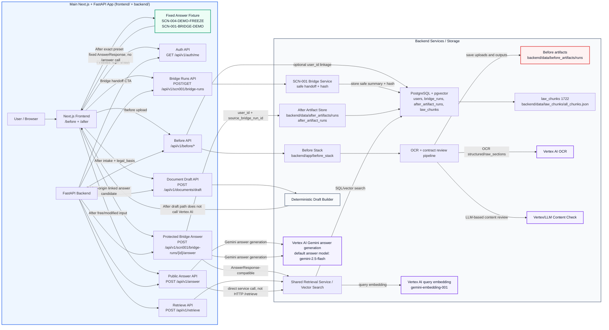

# 법대로(LawMainRoad) — Current Project Architecture

기준일: `2026-05-13`

## 1. 문서 목적

이 문서는 현재 repo의 전체 구조를 `Before/Begin`, `Bridge`, `After` 관점에서 정리한다. 범위는 main `frontend/` + `backend/` 앱에 통합된 `/before`, `/after`, SCN-001 protected Bridge endpoints를 포함한다.

이 문서는 `docs/architecture/cloud_migration_architecture.*`의 target deployment architecture와 다르다. Cloud migration 문서는 후속 GCP cloud migration 목표 구조를 다루며, 이 문서는 현재 구현된 MVP와 현재 repo에 존재하는 병렬 모듈의 실제 상태를 기록한다.

정확한 현재 상태 요약:

- Current architecture has one primary Next.js/FastAPI surface: `/before` + `/after` + `/history` in `frontend/`, and `backend/` FastAPI with mounted Before stack plus SCN-001 protected Bridge/history endpoints.
- Visual checkpoint `85d10fa` includes integrated visual/UI polish, and the
  current code/runtime checkpoint is `b013429`. Later docs/cloud/report refresh
  does not change backend/API/schema/Auth/Bridge/Web Storage policy. The visual
  checkpoint includes
  `DESIGN.md` token-first guide, Before first screen upload focus and OCR 1~2분
  progress copy, After entry centered guidance/disclaimer, History centered fold
  cards with blue accent, Main H1/lead/nav/compact flow strip cleanup, contrast
  fixes, and removal of hardcoded default accessibility legal basis.
- Bridge는 protected `bridge_runs` route/service, `/before` result CTA, `/after` Bridge handoff cards, Phase 7E protected Bridge answer frontend routing, `/after` saved history selector, `/history` archive, MVP soft-delete까지 구현됐다. 독립 `/bridge` UI와 live/backend SCN-001 document draft는 후속 범위다.
- exact `SCN-001-BRIDGE-DEMO` fixed preset has a frontend-local deterministic `workplace_change_reason_summary` frozen draft path. It does not call backend/LLM or `/api/v1/documents/draft`.
- After draft path does not call Vertex AI.
- Before contract upload path currently uses Vertex AI for OCR and LLM-based content review.
- Phase 6F live subset PASS with retry. Vertex IAM/credential issue is runtime resolved; residual runtime risk is transient `provider_timeout`.
- Local LLM / Compute Engine GPU VM is not part of the current MVP architecture. The cloud migration target also excludes it from the 1차 migration scope.
- Cloud migration Phase 7A `www.law-main-road.cloud` public domain launch is
  complete. Phase 7B private GCS artifact storage + operations dashboard is a
  documented optional hardening candidate only; runtime artifact writers still
  use local paths until a GCS adapter is explicitly opened.

## 2. 현재 구현 범위 요약

### Main After/RAG App

| 항목 | 현재 상태 |
|---|---|
| Frontend | `frontend/`, Next.js `/before` + SCN-004 `/after` demo UI |
| Backend | `backend/`, FastAPI |
| API | `GET /api/v1/auth/me`, Before endpoints under `/api/v1/before`, `POST /api/v1/scn001/bridge-runs`, `GET /api/v1/scn001/bridge-runs/{bridge_run_id}`, `POST /api/v1/scn001/bridge-runs/{bridge_run_id}/answer`, `POST /api/v1/retrieve`, `POST /api/v1/answer`, `POST /api/v1/documents/draft` |
| DB | PostgreSQL + pgvector |
| Corpus | `law_chunks` 1722 rows |
| Source of truth | `backend/data/law_chunks/all_chunks.json` |
| Embedding | `gemini-embedding-001`, 768 dimensions |
| Default answer model | `gemini-2.5-flash` |
| Demo preset | `SCN-004-DEMO-FREEZE` exact path는 fixed `AnswerResponse` fixture를 사용하고 `/api/v1/answer`를 호출하지 않음 |
| Modified/free input | `/api/v1/answer` 호출 가능, Shared Retrieval Service + default answer model 기반 Gemini answer generation 사용 |
| Intake to draft | `/api/v1/documents/draft`, deterministic backend layer |
| Draft model boundary | retrieval / answer_generation service를 직접 호출하지 않고, request의 `legal_basis` 안에 있는 근거만 사용 |
| Frontend state | React Context + `useReducer` memory state only |
| Browser storage rule | raw `user_statement`, `answer_response`, `case_intake`, `draft_response`, raw `after_query_seed`는 Web Storage에 저장하지 않음 |

### Main Before Contract Review Stack

| 항목 | 현재 상태 |
|---|---|
| 위치 | `frontend/src/app/before`, `backend/app/before_stack` |
| 성격 | main Next.js/FastAPI 앱에 포함된 SCN-001 Before surface |
| Frontend | `frontend/src/app/before/page.tsx` |
| API service | main `backend/` FastAPI app mounted under `/api/v1/before` |
| Domain | `backend/app/before_stack/services`, OCR / section compare / rule validation / content check / law retrieval / explanation / accessibility recommendation |
| API base | frontend `NEXT_PUBLIC_API_BASE_URL` default `http://localhost:8000` |
| Runtime UI flow | `/before` upload -> loading -> result -> optional protected Bridge handoff CTA |
| Artifact storage | `backend/data/before_artifacts/runs/<run_id>/` |
| OCR | Vertex AI 기반 OCR pipeline |
| Content review | 기본 `LLM_PROVIDER=vertex`, Ollama provider는 local/dev 잔여 교체 구조이며 cloud migration target은 아님 |
| Accessibility | 결과 화면에서 장애 특화 recommendation 선택 확장 |

### Bridge

Bridge는 현재 독립 `/bridge` 화면은 아니지만 protected backend route/service와 `/before` -> `/after` handoff UI는 구현됐다. `POST /api/v1/scn001/bridge-runs/{bridge_run_id}/answer`는 Firebase Bearer auth를 요구하고, missing/unowned Bridge run은 404로 masking하며, `AnswerResponse`-compatible response와 `after_artifact_runs.user_id/source_bridge_run_id` linkage를 사용한다.

Bridge-origin `/after` 결과는 sticky `answer_origin = "bridge_handoff"`를 유지한다. all cards unchecked 상태에서 사용자 질문만으로 질의해도 result는 answer-only이며 draft disabled다. regular draft behavior는 direct `/after` 또는 reset/re-entry에서만 사용한다.

raw `after_query_seed`는 `/api/v1/answer.query` 또는 protected Bridge answer query에 넣지 않는다. Bridge-origin answer query는 displayed safe subset plus user question만 사용한다.

## 3. 전체 컴포넌트 표

| 영역 | 컴포넌트 | 경로 / API | 현재 역할 | 모델 / 데이터 경계 |
|---|---|---|---|---|
| Main App | Next.js Frontend | `frontend/` | `/before`, `/after`, `/after/result`, `/after/intake`, `/after/draft` routes | memory state only, raw payload Web Storage 저장 금지 |
| Main After/RAG | Fixed Answer Fixture | `frontend/src/lib/scenarioPresetAnswers.json` | exact preset 발표 경로 고정 응답 | `/api/v1/answer` 호출 없음 |
| Main After/RAG | FastAPI Backend | `backend/main.py`, `backend/app/routers/*` | retrieval / answer / document draft API 제공 | API contract 변경 없이 유지 |
| Main After/RAG | Retrieve API | `POST /api/v1/retrieve` | public retrieval endpoint | Shared Retrieval Service / Vector Search로 위임 |
| Main After/RAG | Answer API | `POST /api/v1/answer` | `answer_question()` 기반 grounded answer | public Retrieve API를 HTTP로 재호출하지 않고 Shared Retrieval Service를 직접 사용 |
| Main After/RAG | Shared Retrieval Service / Vector Search | `backend/app/services/retrieval.py` | query embedding + PostgreSQL/pgvector search | Vertex query embedding `gemini-embedding-001` 사용 |
| Main After/RAG | Document Draft API | `POST /api/v1/documents/draft` | SCN-004 문서 초안 생성 | deterministic builder, request `legal_basis`만 사용 |
| Main After/RAG | PostgreSQL + pgvector | local DB | `law_chunks` 1722 rows, HNSW index | corpus 검색 저장소 |
| Main After/RAG | Law chunks source | `backend/data/law_chunks/all_chunks.json` | main source of truth | 직접 수정 금지 |
| Before | Next.js Route | `frontend/src/app/before/page.tsx` | 업로드, 진행 상태, 결과, protected Bridge handoff CTA | Firebase logged-in state가 있으면 Bridge run 생성 가능 |
| Before | Mounted FastAPI Stack | `backend/app/before_stack/main.py` | contract review job / sync review / accessibility API | optional auth user linkage |
| Before | Review Job API | `POST /api/v1/before/review/jobs`, `GET /api/v1/before/review/jobs/{job_id}` | 비동기 분석 작업 생성 및 polling | valid Firebase auth가 있으면 internal user_id linkage |
| Before | Sync Review API | `POST /api/v1/before/review` | 동기 계약서 리뷰 | 동일 pipeline 사용 |
| Before | OCR Pipeline | `backend/app/before_stack/services/ocr_pipeline.py` | `structured`, `raw_sections`, `_meta` 생성 | Vertex AI OCR 사용 |
| Before | Contract Review Pipeline | `backend/app/before_stack/main.py` + services | section compare, rule validation, content check, explanation 생성 | deterministic checks + LLM content check |
| Before | LLM Client | `backend/app/before_stack/services/llm_client.py` | Vertex 중심 추상화, Ollama는 local/dev 잔여 provider | 기본 `LLM_PROVIDER=vertex`; cloud migration target 아님 |
| Before | Artifact Storage | `backend/data/before_artifacts/runs` | 업로드 원본, OCR, 리뷰, 설명 markdown 저장 | 개인정보/사업장 정보 포함 가능 |
| Before | Accessibility Recommendation | `POST /api/v1/before/accessibility/recommendations` | 장애 유형/직무 특성 기반 카드 추천 | 기본 분석 이후 선택 확장 |
| Bridge | Protected Bridge Runs API | `POST /api/v1/scn001/bridge-runs`, `GET /api/v1/scn001/bridge-runs/{bridge_run_id}` | safe Before handoff summary 저장/조회 | Firebase Bearer auth required, raw seed persistent 저장 금지 |
| Bridge | Protected Bridge Answer API | `POST /api/v1/scn001/bridge-runs/{bridge_run_id}/answer` | Bridge-origin answer generation and artifact linkage | `AnswerResponse`-compatible, `source_bridge_run_id` single primary |
| Future docs | Cloud migration architecture | `docs/architecture/cloud_migration_architecture.*` | 후속 클라우드 목표 구조 | 현재 MVP 구조와 구분 |

## 4. 기능별 요청 흐름 표

| 기능 흐름 | 요청 흐름 | 모델 사용 | 저장 / 상태 | 현재 통합 상태 |
|---|---|---|---|---|
| After exact preset | User -> Next.js `/after` -> fixed `AnswerResponse` fixture -> `/after/result` | Vertex AI 미사용, `/api/v1/answer` 호출 없음 | React Context memory state | main After app 내부 구현 완료 |
| After modified preset | User modifies preset text -> Next.js -> `POST /api/v1/answer` with `top_k=10`, `ef_search=100` | Shared Retrieval Service + default answer model `gemini-2.5-flash` | React Context memory state | main backend API 사용 |
| After free input | User free statement -> Next.js -> `POST /api/v1/answer` with `top_k=5`, `ef_search=100` | Shared Retrieval Service + default answer model `gemini-2.5-flash` | React Context memory state | main backend API 사용 |
| Retrieval direct | Client -> `POST /api/v1/retrieve` -> Shared Retrieval Service | Vertex query embedding | DB vector search only | main backend API 구현 완료 |
| After intake to draft | `/after/result` grounding + SCN-004 document-type eligibility guard -> `/after/intake` selected type recheck -> `POST /api/v1/documents/draft` -> `/after/draft` | Vertex AI 미사용 | request의 `case_intake`와 `legal_basis`를 deterministic builder가 사용 | main After draft flow 구현 완료 |
| Before async upload | Next.js `/before` upload -> `POST /api/v1/before/review/jobs` -> polling `GET /api/v1/before/review/jobs/{job_id}` | Vertex AI OCR + 기본 Vertex LLM content review | `backend/data/before_artifacts/runs/<run_id>/`에 업로드 원본과 산출물 저장 | main 앱 구현 |
| Before sync review | Client -> `POST /api/v1/before/review` | Vertex AI OCR + 기본 Vertex LLM content review | `backend/data/before_artifacts/runs/<run_id>/`에 업로드 원본과 산출물 저장 | main backend API |
| Before accessibility | Result screen -> `POST /api/v1/before/accessibility/recommendations` | 기본 추천 엔진, Vertex OCR/LLM 경로와 별도 | 선택 입력 기반 result panel 확장 | main 앱 구현 |
| Bridge handoff | `/before` result CTA or `/after` saved history selector -> `POST /api/v1/scn001/bridge-runs` / protected history APIs -> `/after` Bridge cards -> protected or public answer-only result | answer path uses displayed safe subset plus user question; raw seed excluded | `bridge_runs`, optional `after_artifact_runs.user_id/source_bridge_run_id` via protected endpoint | Phase 6A~6F, Phase 7A~7E, history selector/archive, MVP soft-delete 구현 |

SCN-004 draft flow is additionally gated by document-type eligibility. The frontend uses `getScn004DraftEligibility()` on `/after/result` to expose only wage-complaint or unfair-dismissal draft types supported by the answer evidence. The evidence check is not only `cited_articles` / `grounded_context_ids` presence; eligibility is calculated from SCN-004 wage/dismissal patterns in the answer query, `cited_articles`, and grounded `retrieved_chunks`. `/after/intake` rechecks the selected document type before building the draft request and again before submit, so grounded free input outside the supported SCN-004 document types remains answer-only and does not enter the draft flow.

## 5. Mermaid 다이어그램

동일한 다이어그램은 `docs/architecture/current_project_architecture.mmd`에도 별도 저장한다.

## 6. Vertex AI 사용 구간 / 미사용 구간

| 구간 | Vertex AI 사용 여부 | 설명 |
|---|---:|---|
| After exact preset `SCN-004-DEMO-FREEZE` | 미사용 | fixed `AnswerResponse` fixture를 사용하므로 `/api/v1/answer`를 호출하지 않는다. |
| After exact preset `SCN-001-BRIDGE-DEMO` | 미사용 | frontend-local `workplace_change_reason_summary` frozen draft path다. Backend/LLM과 `/api/v1/documents/draft`를 호출하지 않는다. |
| After modified preset | 사용 | `/api/v1/answer`가 Shared Retrieval Service로 Vertex query embedding과 PostgreSQL/pgvector search를 수행한 뒤 default answer model `gemini-2.5-flash`로 answer generation을 수행한다. |
| After free input | 사용 | `/api/v1/answer`가 `top_k=5`, `ef_search=100`으로 Shared Retrieval Service + answer path를 실행한다. |
| Main `POST /api/v1/retrieve` | 사용 | public retrieve endpoint가 Shared Retrieval Service를 통해 query embedding에 `gemini-embedding-001`을 사용하고 PostgreSQL + pgvector에서 검색한다. |
| Main `POST /api/v1/answer` | 사용 | public retrieve endpoint를 HTTP로 재호출하지 않고 Shared Retrieval Service를 직접 사용한 뒤 default answer model `gemini-2.5-flash`로 grounded answer를 생성한다. |
| Main `POST /api/v1/documents/draft` | 미사용 | After draft path does not call Vertex AI. request의 `legal_basis`와 `case_intake`만 사용한다. |
| Before upload OCR | 사용 | Vertex AI OCR pipeline이 업로드 계약서에서 `structured`와 `raw_sections`를 생성한다. |
| Before content review | 사용 | Before contract upload path currently uses Vertex AI for OCR and LLM-based content review. 기본 `LLM_PROVIDER=vertex`다. |
| Before deterministic checks | 부분 미사용 | section comparator, rule validator, law retriever, explanation builder는 deterministic / local asset 기반 로직을 포함하지만 pipeline 전체는 OCR/LLM 단계에서 Vertex를 사용한다. |
| Before accessibility recommendation | 기본 미사용 | 장애 특화 recommendation engine은 별도 추천 로직이며 계약서 OCR/LLM 경로와 분리되어 있다. |
| Protected Bridge answer | 사용 | `POST /api/v1/scn001/bridge-runs/{bridge_run_id}/answer`는 answer generation에서 Vertex를 사용할 수 있고, `after_artifact_runs.user_id/source_bridge_run_id` linkage를 기록한다. |
| Local LLM / Compute Engine GPU VM | 미사용 / 제외 | 현재 MVP와 cloud migration 1차 target 모두에 포함하지 않는다. |

## 7. 개인정보 / 민감정보 처리 경계

### Main After/RAG App

- `SCN-004-DEMO-FREEZE` exact preset은 fixed fixture를 사용하므로 사용자의 exact preset 입력이 `/api/v1/answer`나 Vertex AI로 가지 않는다.
- modified preset / free input은 `/api/v1/answer`를 호출하므로 사용자 진술이 query embedding과 answer generation 과정에서 Vertex AI 경로로 전달될 수 있다.
- `/api/v1/documents/draft`는 deterministic backend layer다. After draft path does not call Vertex AI.
- draft request에는 `case_intake`와 이전 answer에서 만든 `legal_basis`가 포함된다. draft builder는 retrieval / answer_generation service를 직접 호출하지 않고 request의 `legal_basis` 안에 있는 근거만 사용한다.
- main frontend는 React Context + `useReducer` memory state only다. raw `user_statement`, `answer_response`, `case_intake`, `draft_response`는 Web Storage에 저장하지 않는다.
- MVP demo에서는 이름, 연락처, 주소 같은 직접 식별 정보를 필수로 요구하지 않고 placeholder / missing field로 남기는 정책을 유지한다.

### Main Before Contract Review Stack

- 계약서 업로드 파일에는 근로자 개인정보, 사업장 정보, 임금, 주소, 연락처, 외국인등록 관련 신호 등 민감정보가 포함될 수 있다.
- Before contract upload path currently uses Vertex AI for OCR and LLM-based content review. 따라서 “프로젝트 전체에서 개인정보가 Vertex로 가지 않는다”고 표현하면 안 된다.
- 업로드 원본 파일, `ocr_output.json`, `review_result.json`, `user_explanation.md`, 실패 시 `error.txt`가 `backend/data/before_artifacts/runs/<run_id>/` 아래 저장될 수 있다.
- valid Firebase Bearer auth가 있는 Before review job은 optional internal `user_id` linkage를 기록한다. Firebase uid, token, email 같은 provider raw identifier를 business table에 직접 저장하지 않는다.
- 배포 아키텍처에서는 Cloud Storage / DB / logging 정책, retention, access control, artifact URL 보호, 저장 최소화, OCR/LLM provider 고지 정책이 별도로 필요하다.

### Bridge / After Artifact Linkage

- `bridge_runs`는 internal `users.id` 기준 protected SCN-001 Bridge run을 저장한다.
- `after_artifact_runs.source_bridge_run_id`는 MVP에서 single primary Bridge run id만 저장한다.
- multi-bridge full provenance는 Post-MVP join table 후보로 남긴다.
- raw `after_query_seed`는 transient response / memory handoff field이며 answer query나 persistent storage에 넣지 않는다.

## 8. 현재 통합 상태와 향후 통합 방향

### 현재 통합 상태

- 현재 repo에는 main Next.js/FastAPI 앱 안에 `/before`, `/after`, SCN-001 protected Bridge endpoints가 함께 존재한다.
- main After/RAG 앱은 SCN-004 demo freeze와 `/api/v1/retrieve`, `/api/v1/answer`, `/api/v1/documents/draft` contract를 기준으로 안정화되어 있다.
- `/before`는 계약서 업로드 분석, job polling, artifact 저장, accessibility recommendation, optional protected Bridge handoff CTA를 제공한다.
- Bridge는 protected route/service와 `/after` handoff UI까지 구현됐다. 독립 `/bridge` 화면은 후속 범위다.
- Protected Bridge answer endpoint와 frontend protected helper/routing은 구현 완료 상태다.

### 향후 통합 방향

| 후보 | 방향 | 선행 조건 |
|---|---|---|
| Handoff DTO refinement | Before review result에서 Bridge safe subset으로 넘길 canonical field 고도화 | 개인정보 최소화, 저장 위치, 사용자 동의 정책 |
| Multi-bridge provenance | single primary `source_bridge_run_id` 이후 full provenance join table 검토 | MVP 이후 범위와 UI disclosure 정책 |
| Artifact 정책 | local artifact를 배포용 Cloud Storage / DB / TTL 정책으로 전환 | 개인정보 보호, 접근 제어, 로그 마스킹 기준 |
| Runtime hardening | transient `provider_timeout` retry/backoff 또는 UX recovery 정리 | Vertex IAM issue는 runtime resolved 상태로 유지 |

## 9. Cloud migration target과의 관계

- `docs/architecture/cloud_migration_architecture.md`와 `cloud_migration_architecture.mmd`는 후속 GCP migration target architecture의 현재 source로 유지한다. `cloud_migration_architecture.drawio`는 presentation export이며, 현재 Mermaid와 다르면 Phase 0 status에 `drawio regenerate needed`를 기록하고 승인된 diagram workflow로 재생성한다.
- Cloud migration target architecture의 Cloud Run, Cloud SQL, Cloud Storage, Secret Manager, Cloud Logging/Monitoring/Alerting, CI/CD, Terraform remote state 구성은 현재 MVP 구현 상태가 아니다.
- Local LLM / Compute Engine GPU VM은 1차 migration target에서 제외한다.
- 현재 MVP는 main After/RAG에서 Gemini API 기반 retrieval / answer를 사용하고, After document draft는 deterministic builder로 분리한다.
- `backend/app/before_stack`은 현재 Vertex AI OCR/LLM 기반으로 동작하며, `llm_client.py`에 Ollama provider 교체 가능 구조가 남아 있지만 현재 기본값은 `vertex`다. 이 교체 가능성은 현재 코드의 local/dev 잔여 capability 설명일 뿐이며 cloud migration target에 Ollama/Qwen/vLLM 또는 GPU VM을 프로비저닝한다는 뜻이 아니다.

## 10. 주의 / 리스크

| 리스크 | 설명 | 현재 문서화 기준 |
|---|---|---|
| Before 개인정보 경계 | 계약서 업로드는 개인정보/사업장 정보가 포함될 수 있고 Vertex OCR/LLM 및 local artifact storage를 사용한다. | After draft no-Vertex 경계와 분리해서 설명해야 한다. |
| Artifact 노출 | Before artifacts and After answer/draft artifacts are currently written to local run directories. | Cloud Run 배포 전 GCS 전환, 접근 제어, 저장 기간, 민감정보 마스킹 정책 필요 |
| After draft 근거 의존성 | draft 자체는 deterministic이지만 `legal_basis`는 이전 answer 결과에 의존한다. | cited_articles / grounded_context_ids guard와 SCN-004 document-type eligibility guard 유지 필요 |
| API contract 차이 | Before / Bridge protected endpoints는 public `/api/v1/answer` / `/api/v1/documents/draft`와 다른 contract다. | public answer/draft contract unchanged 문구 유지 |
| Bridge 오해 | Bridge handoff와 protected backend endpoints는 구현됐지만 독립 `/bridge` UI와 SCN-001 document draft는 열리지 않았다. | answer-only, sticky `bridge_handoff`, draft-disabled 정책으로 표기 |
| Local LLM 오해 | Cloud migration target에서는 Compute Engine GPU VM / Local LLM을 제외했다. | current target source는 `cloud_migration_architecture.md`와 `.mmd` 기준으로 본다. `.drawio`는 presentation export이므로 stale하면 regenerate note를 우선한다. |
| Generated / artifact directories | `node_modules`, `__pycache__`, `Zone.Identifier`, `dist`, local artifact run directories는 분석 대상에서 제외하거나 artifact로만 취급한다. | 이번 문서 작업에서는 수정하지 않음 |
