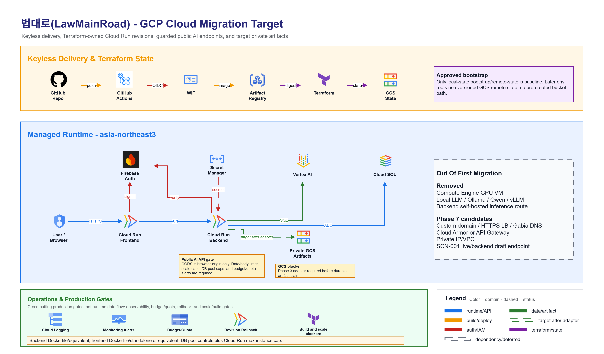
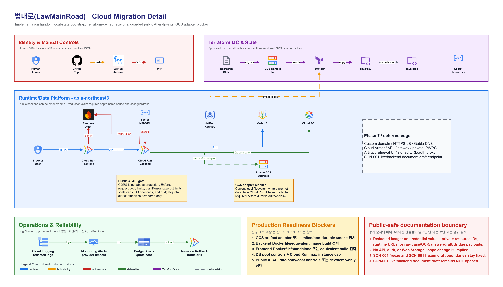

# 최종 아키텍처

기준일: `2026-05-13`

## 기술 스택

| Layer | Choice |
|---|---|
| Frontend | Next.js App Router, React, TypeScript |
| Backend | FastAPI |
| Database | PostgreSQL + pgvector |
| Auth | Firebase Auth Google Sign-In + Firebase Admin SDK verification |
| LLM/OCR | Vertex AI Gemini |
| Embedding | `gemini-embedding-001`, 768 dimensions |
| Local environment | WSL Ubuntu + conda |
| Cloud target | Google Cloud, dev-first migration |

## 전체 시스템 흐름

```text
legalize-kr submodule
  -> preprocessing / chunking scripts
  -> backend/data/law_chunks/all_chunks.json
  -> PostgreSQL law_chunks + pgvector embeddings
  -> retrieval
  -> grounded answer
  -> optional document draft
  -> Next.js frontend
```

## 클라우드 전환 아키텍처

아래 다이어그램은 내부 drawio 산출물에서 공개 가능한 범위만 남긴
public-safe 이미지입니다. 실제 credential 값, 비공개 cloud resource
identifier, runtime URL, raw case/OCR/answer/draft/Bridge payload는 포함하지
않습니다. 이 그림은 dev-first cloud migration과 `demo/contest` 발표 자세를
설명하기 위한 자료이며, production-ready claim이나 production opening을
의미하지 않습니다.

아래 이미지는 클릭하면 원본 PNG로 열 수 있습니다.

### Overview

[](images/cloud-migration-overview.png)

Overview는 GitHub Actions, WIF, Artifact Registry, Terraform, GCP runtime/data
platform의 큰 흐름을 보여줍니다. 현재 public mirror는 deploy authority가
아니며, private development/deploy source와 public submission mirror의 역할은
[[클라우드 전환과 공개 미러 정책|Cloud-Migration-and-Public-Mirror-Policy]]을
따릅니다.

### Detail

[](images/cloud-migration-detail.png)

Detail은 identity/WIF, Terraform IaC/state, Cloud Run frontend/backend,
Firebase Auth, Secret Manager, Vertex AI, Cloud SQL, artifact storage adapter
후보, 운영/비용 guardrail을 한 화면에 정리합니다. dashed/deferred 항목은
후속 검토 후보이며, SCN-001 live/backend document draft endpoint는 여전히
미오픈(NOT opened) 상태입니다.

## Runtime Surfaces / 실행 표면

| Surface | 역할 | 공개 경계 |
|---|---|---|
| `/after` flow | SCN-004 answer/draft와 SCN-001 fixed preset story | SCN-004는 login-free, fixed preset 우선 |
| `/before` flow | SCN-001 contract review와 Bridge handoff 시작 | actual analysis에는 frontend login-required UX 적용; mounted Before APIs는 문서화된 대로 public/optional-auth 유지 |
| `/history` | SCN-001 record archive | backend-verified users only |
| FastAPI public APIs | retrieval, answer, SCN-004 draft | stable public contracts |
| FastAPI protected APIs | SCN-001 history, Bridge run, Bridge answer | Firebase-backed backend verification |

## Backend

Application boundary / 애플리케이션 경계:

- FastAPI application layer

핵심 책임:

- law retrieval
- grounded answer generation
- SCN-004 document draft generation
- Firebase token verification
- SCN-001 protected Bridge/history/deletion paths

Public-safe API responsibility areas / 공개 가능한 API 책임 영역:

- retrieval API area
- auth status API area
- answer generation API area
- SCN-004 draft API area
- SCN-001 protected history/Bridge API area

## Frontend

구현 routes:

- `/`
- `/before`
- `/after`
- `/after/result`
- `/after/intake`
- `/after/draft`
- `/history`

State는 React Context + reducer memory state입니다. 민감한 raw flow payload는
Web Storage에 저장하지 않습니다.

## Auth Boundary / 인증 경계

```text
Firebase Web SDK
  -> Firebase ID token
  -> Authorization: Bearer <id token>
  -> backend Firebase Admin verification
  -> backend-owned project account linkage
```

SCN-001 protected actions는 backend-verified auth를 요구합니다. SCN-004 After는
login-free로 유지합니다.

## Model and Draft Boundaries / 모델과 초안 경계

- Live retrieval과 live answer paths는 Vertex AI Gemini와 PostgreSQL +
  pgvector retrieval을 사용할 수 있습니다.
- SCN-004 exact preset은 fixed frontend fixture를 사용하며 live answer
  generation을 호출하지 않습니다.
- `/api/v1/documents/draft`는 request `case_intake`와 answer-derived
  `legal_basis`를 사용하는 deterministic draft builder입니다.
- SCN-001 exact frozen draft는 frontend-local이며 backend draft endpoint를 호출하지 않습니다.
- Bridge는 사건 맥락 연결/참고용이며, 법적 근거(legal grounding)가 아닙니다.

## Deployment Posture / 배포 운영 자세

Cloud migration은 현재 dev-first입니다.

- first Terraform target: `dev`
- public presentation posture: `demo/contest`
- public demo URL: `https://www.law-main-road.cloud`
- latest code/runtime checkpoint: `b013429`
- production-ready claim: 없음
- production opening: 별도 review 필요

Phase 7A custom domain 연결은 `www` host에 한정되어 완료됐습니다. Same-origin
`/api/**`, root apex, `api.*`, HTTPS Load Balancer, Cloud Armor는 별도 gate입니다.
Phase 7B private GCS artifact storage + operations dashboard는 후보 설계가
문서화된 상태이며, runtime GCS writer나 artifact retrieval UI가 구현됐다는
주장은 하지 않습니다.

## 함께 보기

- [[데이터 모델과 개인정보 경계|Data-Model-and-Privacy]]
- [[API 엔드포인트와 스키마|API-Endpoints-and-Schemas]]
- [[RAG와 법령 코퍼스|RAG-and-Law-Corpus]]
- [[클라우드 전환과 공개 미러 정책|Cloud-Migration-and-Public-Mirror-Policy]]
