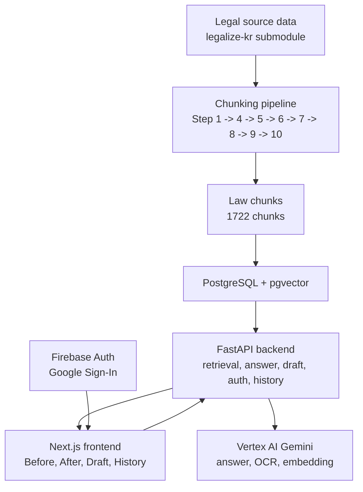

# 홈 (Home)

법대로(LawMainRoad)는 외국인 근로자와 취약 노동자가 근로계약, 임금체불,
부당해고, 사업장 변경 같은 노동 문제를 한국 노동법 근거와 함께 정리할 수
있도록 돕는 AI 지원 MVP입니다.

이 문서는 공개 README 이후 이어지는 상세 문서입니다. 현재 구현된 기능,
아키텍처, API, 보안/개인정보 경계, 검증 방법, 클라우드 전환 정책을
사용자와 심사자가 읽을 수 있는 형태로 정리합니다.

---

## 먼저 읽기

이 Wiki는 다음 순서로 읽는 것을 권장합니다.

1. [[프로젝트 수행 및 완성|Project-Execution-and-Completion]] - 프로젝트 요약과 현재 완료 범위
2. [[최종 아키텍처|Final-Architecture]] - 시스템 전체 구조와 주요 경계
3. [[사용자 흐름|User-Flows]] - Before, Bridge, After, History 흐름
4. [[RAG와 법령 코퍼스|RAG-and-Law-Corpus]] - 법령 데이터, 검색, 근거 답변 기준
5. [[E2E 데모 검증|E2E-Demo-Verification]] - 공개 가능한 검증 요약

---

## 프로젝트 상태

기준일: `2026-05-11`

| 영역 | 상태 |
|---|---|
| SCN-004 After answer/draft demo | 완료 |
| SCN-001 Before -> Bridge -> After answer linkage | 완료 |
| SCN-001 protected history and MVP soft-delete | 완료 |
| SCN-001 fixed-preset frozen draft demo | 완료 |
| Firebase Auth integration | 완료 |
| Frontend visual polish | 2026-04-29 visual baseline까지 완료 |
| Cloud migration | dev-first runtime + Phase 7A public `www` domain launch 완료 |
| Public demo URL | `https://www.law-main-road.cloud` |
| Production opening | 미오픈(NOT opened) |

---

## 제공 기능

- 한국 노동법 chunk를 검색하고 evidence-led answers를 생성합니다.
- 검색된 legal context로 뒷받침되는 경우에만 citations를 표시합니다.
- SCN-001 계약/기숙사/사업장 변경 risk signals를 검토합니다.
- Bridge를 통해 Before findings를 After questions에 연결합니다.
- answer-derived legal basis를 바탕으로 지원되는 SCN-004 draft documents를 생성합니다.
- logged-in SCN-001 users에게 protected history와 MVP soft-delete를 제공합니다.

---

## 공개 문서 경계

이 Wiki는 내부 phase log를 그대로 공개하지 않습니다. `docs/planning/`,
`docs/architecture/`, `docs/ops/`, `docs/specs/`, `docs/product/`,
`docs/demo/`의 구현 근거를 읽고, 공개 가능한 수준으로 다시 정리한 문서입니다.

문서의 기준은 current code-based status입니다. 오래된 설계 메모와 충돌하는
경우 SCN-004 demo freeze, SCN-001 protected flow, cloud dev-first 정책,
public mirror 정책을 우선합니다.

---

## 범위 경계

구현됨:

- SCN-004 login-free After flow
- SCN-001 backend-verified protected flow
- Firebase Google Sign-In + backend Firebase Admin verification
- PostgreSQL + pgvector retrieval foundation
- frontend-local fixed preset path for demo stability
- user-facing Korean summaries and prominent disclaimers

미오픈(NOT opened):

- live/backend SCN-001 document draft generation
- protected SCN-001 draft endpoint
- independent `/bridge` route
- Recovery implementation
- SCN-005 frontend/document draft expansion
- root apex / `api.*` domain / same-origin `/api/**` routing
- HTTPS Load Balancer / Cloud Armor
- full retention lifecycle, hard delete, and artifact file purge
- production deployment claim

---

## 아키텍처 개요

---

## Wiki 내비게이션

### 기초 문서

- [[프로젝트 수행 및 완성|Project-Execution-and-Completion]]
- [[범위 및 비목표|Scope-and-Non-Goals]]
- [[설계 원칙|Design-Principles]]

### 아키텍처

- [[최종 아키텍처|Final-Architecture]]
- [[RAG와 법령 코퍼스|RAG-and-Law-Corpus]]
- [[데이터 모델과 개인정보 경계|Data-Model-and-Privacy]]
- [[보안 모델|Security-Model]]

### 제품과 API

- [[사용자 흐름|User-Flows]]
- [[UI 화면 구성|UI-Screens]]
- [[API 엔드포인트와 스키마|API-Endpoints-and-Schemas]]

### 배포와 운영

- [[배포와 실행 가이드|Deployment-and-Setup-Guide]]
- [[클라우드 전환과 공개 미러 정책|Cloud-Migration-and-Public-Mirror-Policy]]
- [[트러블슈팅 런북|Runbook-Troubleshooting]]

### 품질과 참고

- [[테스트 전략|Testing-Strategy]]
- [[E2E 데모 검증|E2E-Demo-Verification]]
- [[ADR 설계 결정|ADR-Design-Decisions]]
- [[용어집|Glossary]]
